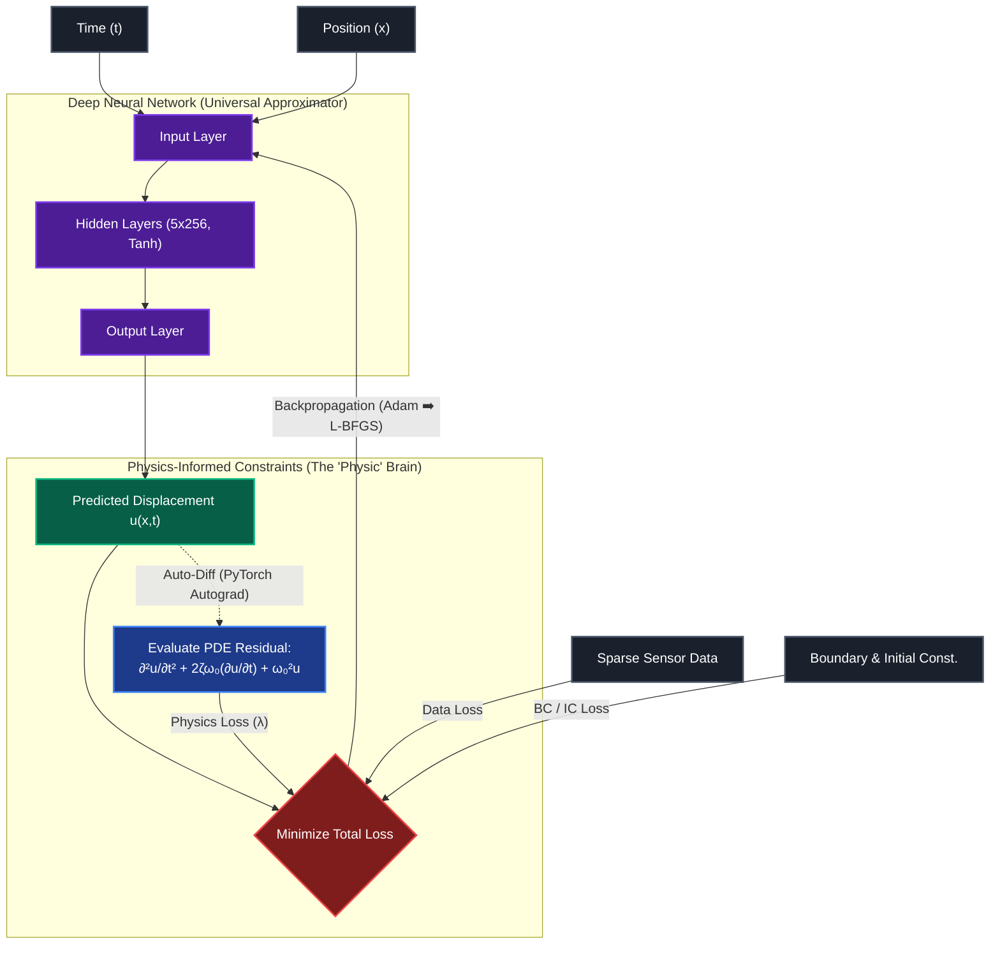

<div align="center">
  <h3>⚛️ Physics-Informed Neural Network (PINN)</h3>
  <p><strong>Predicting Structural Vibrations by Bridging Deep Learning and Classical Physics</strong></p>

  [](https://www.python.org)
  [](https://pytorch.org/)
  [](https://streamlit.io/)
  [](https://opensource.org/licenses/MIT)

</div>

---

## 🎯 Overview

This project implements a **Physics-Informed Neural Network (PINN)** to accurately predict structural vibrations (displacement field over time and space). Unlike pure data-driven Deep Neural Networks (DNNs) that require millions of data points and suffer from severe hallucination outside their training distribution, this model mathematically enforces physical laws into the loss function.

By integrating the **Damped Wave Equation** directly into the computational graph using automatic differentiation, this model demonstrates:
- **Extreme Data Efficiency:** Capable of converging with merely ~5,000 data points.
- **Explainability & Parameter Discovery:** Learns hidden physical constants such as Natural Frequency ($\omega_0$) and Damping Ratio ($\zeta$)—solving the *Inverse Problem*.
- **Robust Extrapolation:** Adheres stringently to the laws of physics, making it highly reliable for engineering predictions.

---

## 🚀 Features & Innovations

1. **PDE Constraint via Auto-Diff:** Instead of relying solely on supervised boundary constraints, physics equations are calculated explicitly using PyTorch's `autograd`.
2. **Two-Stage Hybrid Optimization:** Integrates an `Adam` optimizer (for rapid initial error bounding) followed by an `L-BFGS` optimizer (for high-precision fine-tuning and strict convergence).
3. **Interactive Digital Twin Dashboard:** A premium, real-time interactive Streamlit web dashboard meant for visualizing the physical limits, plotting 3D wave propagations, and training the network locally on the web interface.

---

## 🛠️ Quick Start (5 Mins)

### 1. Installation
Clone the repository and install the required dependencies (recommended to use a virtual environment).

```bash
git clone https://github.com/yourusername/physics-neural-network.git
cd physics-neural-network
pip install -r requirements.txt
```

### 2. Live Interactive Dashboard (Recommended)
Experience the project visually via a high-quality dashboard. It features live training demos, hyperparameter tuning, and a 3D computational physics simulator.

```bash
streamlit run app_demo.py
```

### 3. Model Training (CLI)
To train the PINN engine from scratch on your terminal, computing the gradients mathematically:

```bash
python pinn_complete_starter.py
```
> **Output:** A compiled `.pth` brain (model weights) and a `.png` spatial-temporal evaluation plot comparing the PINN prediction vs Analytical Ground Truth.

### 4. Running Inference
Once trained, use the model to extract the learned parameters or predict occurrences at arbitrary coordinates constraint-free.

```bash
# Query a single dimension
python predict.py --x 0.5 --t 1.0

# Extract learned physics constants (Damping / Frequency)
python predict.py --params-only
```

---

## 🧠 Sequence & Architecture PINN

Diagram berikut menunjukkan bagaimana model memproses input waktu dan posisi, dilewatkan pada jaringan saraf, dan bagaimana *auto-differentiation* secara terus-menerus memaksa mesin agar sesuai dengan persamaan matematika fisika (Hukum Gelombang):



---

## 📐 Mathematical Formulation

The neural network acts as a universal function approximator predicting structural displacement $u(x,t)$. The network's physics constraint (Loss Physics) strictly enforces the 1D damped wave equation:

$$ \mathcal{L}_{physics} = \left\| \frac{\partial^2 u}{\partial t^2} + 2\zeta\omega_0 \frac{\partial u}{\partial t} + \omega_0^2 u \right\|^2 $$

Where:
- $u$ = Displacements
- $\omega_0$ = Natural frequency
- $\zeta$ = Damping ratio

The total training objective balances $\lambda_{physics} \mathcal{L}_{physics} + \lambda_{data} \mathcal{L}_{data} + \mathcal{L}_{BC} + \mathcal{L}_{IC}$.

---

## 🌍 Real-World Engineering Applications

* **🏗️ Structural Health Monitoring (SHM):** Early deduction of framework degradation in bridges or skyscrapers (identifying sudden changes in damping limits).
* **✈️ Aerospace Engineering:** Combating severe flight-bound resonance (*wing flutter*) using inverse problem mappings.
* **♨️ Mechanical & Digital Twins:** Deploying sub-millisecond virtual simulations mimicking precise car suspension dynamics, bypassing slow and expensive traditional Finite Element Method (FEM) software.

---

## 📁 Repository Structure

```tree
physics-neural-network/
├── pinn_complete_starter.py    # Main PINN Engine (Architecture & Two-Stage Optimizer)
├── app_demo.py                 # Premium Interactive Web App Dashboard
├── predict.py                  # CLI Interface for trained model inference
├── requirements.txt            # Project dependencies
├── pinn_vibration_guide.md     # In-depth theoretical physics guides formulation
├── experiments/                # Alternative equations (Heat Eq, Fluid Dynamics)
└── tests/                      # Validation test sets
```

---

## 🤝 Contribution & License

Contributions, issues, and feature requests are welcome!
Feel free to check the **[issues page](https://github.com/mfebykhoirusidqi/Physics-Informed-Neural-Network)** if you want to contribute.

This project is licensed under the **MIT License**. Use it freely for academic research, learning, or commercial frameworks.

<div align="center">
  <i>"Don't just teach Machines how to read Data. Teach them how the Universe works."</i>
</div>
